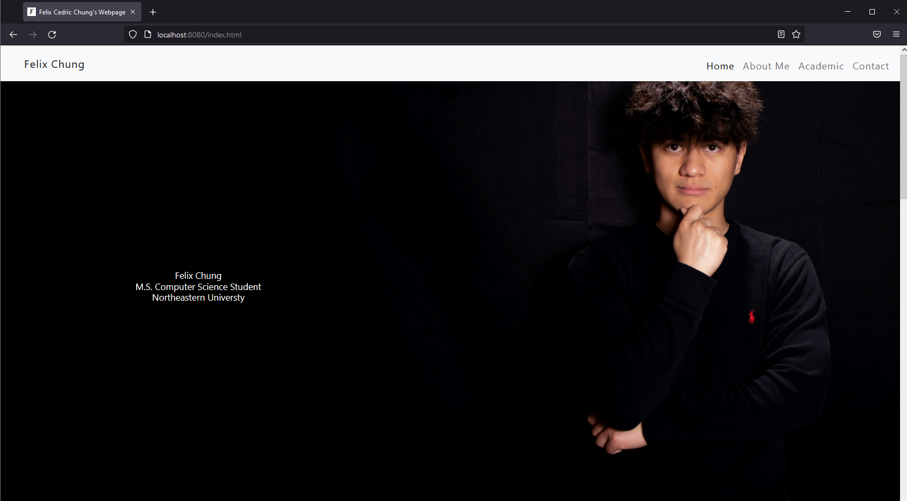

# Felix's Home Page

Website for project 1 in [CS5610 Web Development](https://johnguerra.co/classes/webDevelopment_fall_2021/). 
## Project Objective
The objective is to build a personal website that showed personal and professional information.
The should should show no error in the [W3C Compliant](https://validator.w3.org/#validate_by_input)
It should have at least two pages with different URL.
It should have a least one Javascript feature with more than 5 lines written by myself.

 [Link to homepage](https://fcchung.github.io/felix-website/index.html)

## Tech requirements

- The home page should be able to opeb on most browser
    -Chrome, Firefox, Safari, Internet Explore etc...

## How to Use?

- The index.html page is the Homepage of the website. 
- The "Felix Chung" on top left conner will bring the user back to the home page.
- The aboutMe tab will take user to the homepage about me section. 
- The academic tab will take the user to the academic.html page which includes academic information
- Contact tab will take user to the homepage contact section.

## [Video Demostration](video/introduction.mp4)

